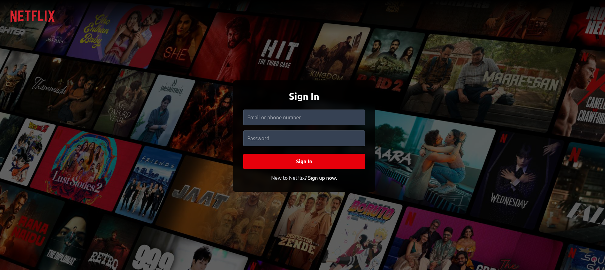
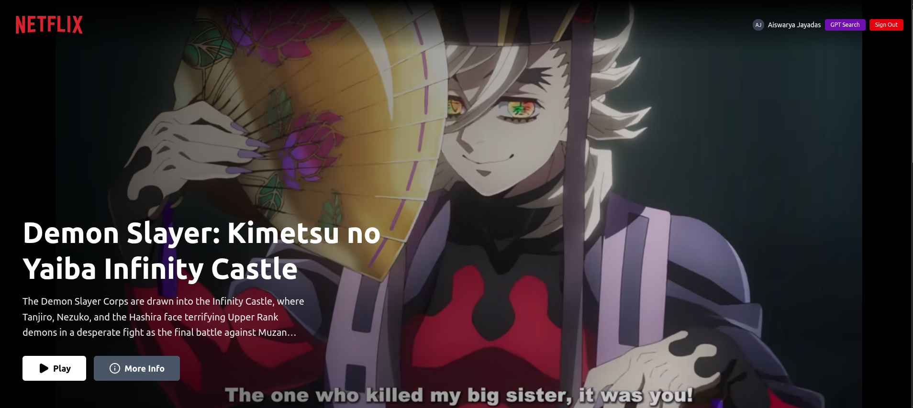
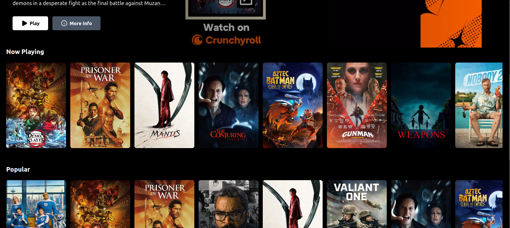
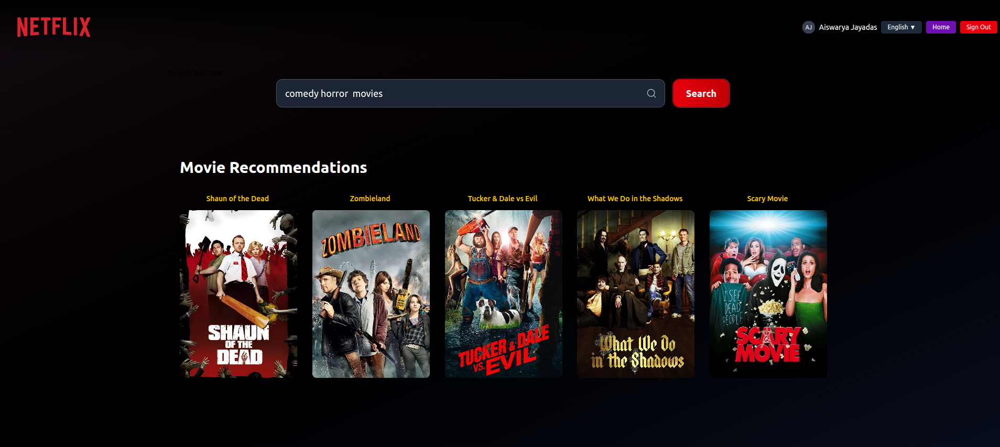

# Netflix GPT

A Netflix-inspired web application with AI-powered movie recommendations.

🔗 [Live Demo](https://netflix-gpt-b889a.web.app/)

---

  
  
  


---

## Overview

**Netflix GPT** is a responsive web application that combines curated movie data with natural-language AI recommendations. Users can browse trending and popular films, sign in to manage profiles, and receive tailored movie suggestions by describing what they want to watch in plain English.

### Key Features

- Browse trending, popular, and now-playing movies
- AI-powered search for natural language recommendations
- User authentication and profile management
- Auto-playing movie trailer on the homepage

---

## Tech Stack

- **Frontend:** React + Vite
- **Styling:** Tailwind CSS
- **State Management:** Redux Toolkit
- **Authentication & Hosting:** Firebase
- **AI Recommendations:** Groq AI
- **Movie Data:** TMDB API

---

## Quick Start

1. **Clone the repository**

```bash
git clone https://github.com/AISWARYAJAYADAS/Netflix-Gpt.git
cd netflix-gpt
```

2. **Install dependencies**

```bash
npm install
```

3. **Set up environment variables**
   Create a `.env` file:

```env
VITE_TMDB_API_KEY=your_tmdb_api_key
VITE_TMDB_ACCESS_TOKEN=your_tmdb_access_token
VITE_GROQ_API_KEY=your_groq_api_key
```

4. **Start the app**

```bash
npm run dev
```

Visit `http://localhost:5173` to see the app.

## How It Works

### Authentication

- Users can sign up or sign in using email and password
- Firebase handles secure authentication
- User profiles are stored and managed

### Movie Browsing

- Fetches movie data from TMDB API
- Displays movies in organized categories
- Shows movie posters and information

### AI Recommendations

- Users type what they want to watch (e.g., "action movies with explosions")
- Groq AI processes the query and suggests 5 movies
- TMDB API fetches detailed movie information
- Results are displayed in a responsive grid

### Responsive Design

- Works on mobile, tablet, and desktop
- Clean, Netflix-inspired interface
- Smooth animations and transitions

## Deployment

The app is deployed on Firebase Hosting:

```bash
npm install -g firebase-tools
firebase login
firebase init
firebase deploy
```

## Development

- `npm run dev` - Start development server
- `npm run build` - Build for production
